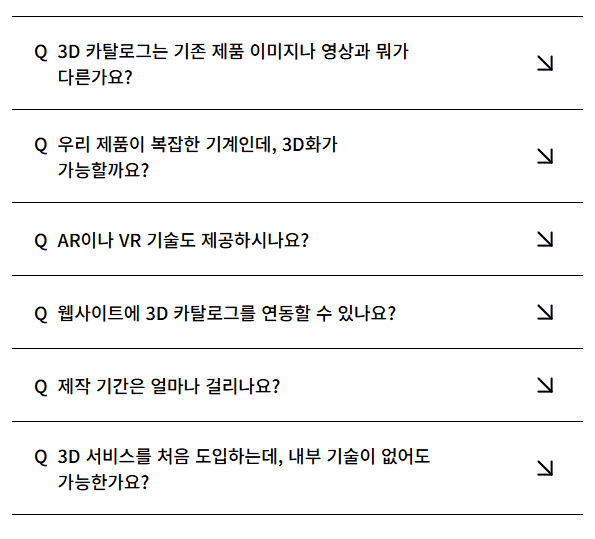

# JavaScript 2주차 과제

멋사 프론트엔드 14기 2주차 과제 문서입니다. <br/>
아코디언 컴포넌트 만들기

- [피그마 시안 링크](https://www.figma.com/design/eedDmvcP6QHytHauOL809o/accordion?node-id=0-1&p=f&m=draw)

## 목차

- [HTML](#html)
- [CSS](#css)
- [JavaScript](#javascript)
- [아코디언 버튼 구현](#아코디언-버튼-구현)
- [2주차 회고](#2주차-회고)

## HTML

- 웹 접근성을 고려하여 작성.
- 구조

```html
<div class="accordion-container">
  <div class="accordion-wrapper">
    <div class="contents-box">
      <div class="contents-header" tabindex="0" role="button" aria-expanded="false" aria-controls="contents1">
        <p>
          <span aria-hidden="true">Q</span>
          <span>3D 카탈로그는 기존 제품 이미지나 영상과 뭐가 다른가요?</span>
        </p>
        <span class="header-icon" aria-hidden="true">
          <svg width="32" height="32" viewBox="0 0 32 32" fill="none" xmlns="http://www.w3.org/2000/svg">
            <path d="M9.33335 9.33334L22.6667 22.6667" stroke="currentColor" stroke-width="2" stroke-linecap="round" stroke-linejoin="round" />
            <path d="M22.6667 9.33334V22.6667H9.33335" stroke="currentColor" stroke-width="2" stroke-linecap="round" stroke-linejoin="round" />
          </svg>
        </span>
        <span class="sr-only">답변 보기</span>
      </div>
      <div class="contents" id="contents1" hidden>
        <p>
          <span aria-hidden="true">A</span>
          <span class="content-answer"
            >3D 카탈로그는 단순히 제품을 '보여주는' 것을 넘어, 고객이 직접 제품을 회전시키고 확대·축소하면서 '체험'할 수 있는 형태입니다. <br />
            정지된 이미지나 일방향 영상과 달리, 제품의 구조나 디테일을 입체적으로 이해할 수 있어 설명 없이도 설득이 가능합니다.
          </span>
        </p>
      </div>
    </div>

    ...
  </div>
</div>
```

### 분석

- `class="contents-header"`를 `div`태그로 작성하여 키보드로 접근시 포커스가 잡히지 않아
  `tabindex=0` 추가
- `aria-expanded="false"`속성을 추가함으로써 요소가 확장되어 있는지 여부를 스크린 리더 등 보조 기술에게 알려주기 위해 추가.`JavaScript로 제어`
- `aria-controls="contents1"`속성을 추가함으로써 어떤 DOM 요소를 제어하고 있는지를 지정,<br/>
  ID로 연결 한다.
- `<span aria-hidden="true">Q</span>, <span aria-hidden="true">A</span>`와 `<svg> 아이콘`경우 디자인적인 요소이므로 `aria-hidden="true"` 추가

## CSS

- 단위:`rem`, color:`hex`
- 구조

```css
* {
  box-sizing: border-box;
  word-break: keep-all;
}

button {
  border: 0;
  background-color: transparent;
  cursor: pointer;
  padding: 0;
}

p {
  margin: 0;
}

main {
  display: flex;
  align-items: center;
  justify-content: center;
}

.sr-only {
  position: absolute;
  width: 0.0625rem;
  height: 0.0625rem;
  padding: 0;
  margin: -0.0625rem;
  overflow: hidden;
  clip: rect(0, 0, 0, 0);
  white-space: nowrap;
  border-width: 0;
}

.accordion-container {
  inline-size: 35.6875rem;
}

.contents-box {
  border-top: 0.0625rem solid #000;
  padding: 1.25rem 1.375rem;

  &:last-child {
    border-bottom: 0.0625rem solid #000;
  }
}

.contents-header {
  background-color: transparent;
  display: flex;
  align-items: center;
  justify-content: space-between;
  font-weight: 500;
  font-size: 1.125rem;
  cursor: pointer;

  & p {
    display: flex;
    flex: 1;
    max-inline-size: 24.9375rem;
    gap: 10px;
  }

  & .header-icon {
    inline-size: 2rem;
    block-size: 2rem;
    transition: transform 0.3s ease;

    &.active {
      color: #ff5c00;
      transform: rotate(-90deg);
    }
  }
}

.contents {
  display: flex;
  font-weight: 500;
  font-size: 1.125rem;
  opacity: 0;
  visibility: hidden;
  transition: all 0.3s ease;
  block-size: 0;

  & p {
    display: none;
    gap: 10px;

    .content-answer {
      color: #3b3b3b;
      font-size: 0.875rem;
      line-height: 1.25rem;
    }
  }

  &.active {
    opacity: 1;
    visibility: visible;
    block-size: auto;
    margin-top: 2.1875rem;

    & p {
      display: flex;
    }
  }
}
```

### 결과

- `transition`속성을 사용해 부드러운 애니메이션 효과

## JavaScript

- 함수를 사용하여 재사용, 유지보수등을 고려하여 작성
- 구조

```js
'use strict';

const contentsHeader = document.querySelectorAll('.contents-header');
const contentsAllButton = document.querySelector('.contentsAll-button');

contentsHeader.forEach((item) => {
  item.addEventListener('click', toggleAccordion);
  item.addEventListener('keydown', keyboardApproach);
});

// Accordion Keybord Approach Function
function keyboardApproach(e) {
  if (e.key === 'Enter' || e.key === ' ') {
    e.preventDefault();
    // toggleAccordion 함수 재사용
    // this => .contents-header
    toggleAccordion.call(this);
  }
}

// Toggle Accordion Function
function toggleAccordion() {
  // this => .contents-header
  const contents = this.parentElement.querySelector('.contents');
  const icon = this.querySelector('.header-icon');
  const isActive = contents.classList.contains('active');

  contentsHeader.forEach((header) => {
    header.setAttribute('aria-expanded', 'false');
  });

  document.querySelectorAll('.contents').forEach((content) => {
    classListRemove(content, 'active');
    content.setAttribute('hidden', '');
  });

  document.querySelectorAll('.header-icon').forEach((icon) => {
    classListRemove(icon, 'active');
  });

  if (!isActive) {
    classListAdd(contents, 'active');
    contents.removeAttribute('hidden');
    classListAdd(icon, 'active');
    this.setAttribute('aria-expanded', 'true');
  }
}

// ClassList Add,Remove Function
function classListAdd(el, className) {
  el.classList.add(`${className}`);
}

function classListRemove(el, className) {
  el.classList.remove(`${className}`);
}
```

### 분석

- `.contents-header`의 태그가 `button`이 아니기 때문에 키보드로 접근이 불가 하여 <br />
  `keydown`이벤트 추가 함수 작성
- `.contents`의 내용이 보일시<br/>
  `.contents-header`의 `aria-expanded='true'`,<br/> `.contents`의 `hidden`속성 제거,<br/>
  `.contents`의 `active` class 추가

## 아코디언 버튼 구현



## 2주차 회고

2주차 JavaScript 강의내용은 흥미로웠습니다.<br/>
이벤트 리스너, UI 컴포넌트, 배열 등 UI-Project를 진행하며 기능 구현하는데에 있어 많이 다루었던 내용들이라 집중도 잘되었습니다.<br/> 강의 중간중간 제가 작성했던 코드와 강사님의 코드를 비교하며 코드 구조, 구현 방식에서의 차의를 발견하며 더 깔끔한 패턴의 코드를 익힐 수 있었습니다.<br/>
또한 과제를 수행하며 피그마를 이번 부트캠프를 통해 처음 접해보았는데, 간단한 아코디언 버튼 피그마 시안 만드는 데에도 많은 시간이 걸렸습니다. 이 과정을 통해 디자인 툴에 대한 기본 감각등을 익히는 계기가 되어 좋았습니다.<br/>
피그마 튜토리얼 영상이나 자료등을 미리 학습하여 실습 속도를 높이는 연습을 해나갈 계획입니다.
